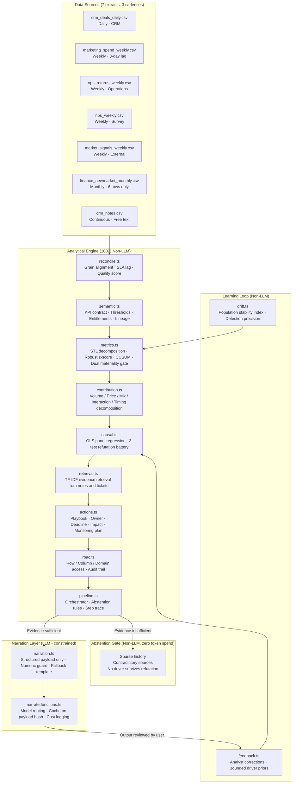

# NarrateIQ

**KPI Intelligence-to-Action Engine**
Accenture Innovation Challenge 2026 · Track 3 · BusinessIntelligence.ai · Round 2

> **For judges reviewing this repository:** The "How to evaluate this in three minutes" section below the demo scenarios table is written specifically for you. It walks through every judging criterion in order with exact navigation steps.

---

## What this is

NarrateIQ answers the question every enterprise BI platform leaves unanswered: not *what* moved, but *why* it moved, *who* owns the fix, and *what* to do before it gets worse.

It does this by enforcing a strict separation between two jobs that most tools conflate:

| Job | Who does it | How |
|-----|-------------|-----|
| Decide what is true | The engine | Deterministic statistics. Same input, same output, fully auditable. |
| Explain what is true | The language model | Constrained narration. The model receives computed facts only and is rejected if it invents a number. |

The language model never decides whether something is an anomaly. It never ranks a driver. It never produces a number that was not explicitly supplied to it. A deterministic guard checks every draft and falls back to a template if the check fails.

When evidence is insufficient (because history is too short, because sources contradict each other, or because no driver survives the refutation tests) the engine abstains and states the exact condition that would unlock a conclusion. Abstention is a first-class output, not a failure state.

---

## The four demo scenarios

Use the scenario bar at the bottom of the application. Each scenario recomputes from the source data on selection: nothing is pre-rendered or hardcoded.

| Scenario | Persona | KPI | What it demonstrates |
|----------|---------|-----|----------------------|
| A | CFO | Total Revenue | Full pipeline: detection, decomposition, two validated drivers, one rejected driver, three assigned actions with monitoring plans, cost telemetry |
| B | Regional Sales Manager | Total Revenue | Same KPI, same anomaly: different data panel, different attribution, restricted actions. Row-level entitlement changes the analytical result, not only the presentation |
| C | CFO | New Market Revenue | Abstention on sparse history: 6 observations against a minimum of 24. Zero LLM tokens spent. Interim business-rule benchmark provided |
| D | CFO | Product Return Rate | Abstention on contradictory evidence: operations data and NPS survey data disagree. Engine asks one clarification question rather than fabricating a cause |

**Scenario B is the critical one.** The Regional Sales Manager sees a different contribution percentage than the CFO for the same revenue decline because row-level entitlement filters the regression panel before it runs. This is a property of the engine, not a hand-authored variant.

---

## How to evaluate this in three minutes

This section is written specifically for judges and reviewers. Follow these steps in order and every judging criterion will be visible without navigating blind.

**Step 1 - Open the app and log in as CFO.** The dashboard loads with five KPI cards. Notice that every card shows the detection method, the z-score, and the source freshness. These are computed from the CSV files, not hardcoded.

**Step 2 - Click "Generate Decision Brief" on Total Revenue (Scenario A).** Watch the loading screen. It shows each pipeline step one at a time with a NON-LLM or LLM label. Four of five steps are non-LLM. The fifth step narrates what the first four already concluded. This is the architectural separation made visible.

**Step 3 - Read the brief.** Section 1 shows what changed with statistical detail. Section 2 shows three driver hypotheses: two validated (competitor pricing at HIGH confidence, billing migration at MEDIUM confidence) and one rejected (seasonality, with the rejection reason shown). Section 3 shows three assigned actions, each with a named owner, a deadline, a dollar impact estimate, and a monitoring plan. Section 4 shows the uncertainty that cannot be resolved and states exactly what data would resolve it.

**Step 4 - Expand the evidence panel on the competitor pricing driver.** You will see 47 CRM notes matched by TF-IDF with relevance scores. The source is cited. This is not the language model guessing; it is a retrieval result from the text corpus.

**Step 5 - Switch to Scenario B (same KPI, Regional Sales Manager).** The contribution percentages on the driver table change. This happens because the row filter restricts the regression panel to the South region before the OLS model runs. The billing timing action disappears from the action list because the RSM has no decision rights over the recognition cut-off. A notice counts the withheld actions.

**Step 6 - Switch to Scenario C (New Market Revenue).** The brief does not exist. The engine reports 6 observations against a minimum of 24, explains that it cannot establish a variance band, and provides an interim benchmark instead. The telemetry panel shows zero tokens spent.

**Step 7 - Switch to Scenario D (Product Return Rate).** The engine identifies that operations data and NPS survey data are logically inconsistent (returns up, satisfaction up), presents two plausible hypotheses, and asks one clarification question rather than choosing between them. Zero tokens spent.

**Step 8 - Open the telemetry panel (CFO only, footer link).** You will see model tier, routing reason, cache hit status, input and output tokens, cost per insight, latency, and the access rule applied per brief. Noise and abstention rows show zero cost.

**Step 9 - Submit a feedback correction on any brief.** Reject a driver with a comment. Regenerate the brief. The driver's confidence score will be lower because the prior has been updated. The brief states which corrections are active and why.

---

## Judging criteria - where to find each one

| Accenture criterion | Engine module | Where to see it in the demo |
|--------------------|---------------|----------------------------|
| Detects and prioritises material KPI movements | `src/engine/metrics.ts`, `src/engine/stats.ts` | Dashboard signal badges: ANOMALY, WATCH, NOISE, SPARSE. Brief header shows z-score, CUSUM peak, materiality threshold, and the reason for the classification |
| Reconciles heterogeneous data sources | `src/engine/reconcile.ts` | Brief section "Sources and grain alignment": SLA lag, quality score, and reconciliation decisions per source |
| Identifies and ranks explanatory drivers using appropriate methods | `src/engine/causal.ts`, `src/engine/contribution.ts`, `src/engine/retrieval.ts` | Driver table: coefficient, confidence interval, p-value, three refutation test results, TF-IDF evidence citations, rejected driver with rejection reason |
| Generates persona-specific narratives with traceable evidence | `src/engine/rbac.ts`, `src/engine/narration.ts` | Scenario A versus Scenario B: different data, different drivers, different actions, different narrative framing |
| Communicates uncertainty and abstains | `src/engine/pipeline.ts` | Scenarios C and D: abstention banner, observation count, unlock condition, zero token spend shown in telemetry |
| Recommends practical actions grounded in business levers | `src/engine/actions.ts` | Assigned actions table: lever, owner, deadline, expected impact in USD, decision rights by persona, monitoring plan with metric, threshold, and first review date |
| Learns from analyst and business-user feedback | `src/engine/feedback.ts`, `src/engine/drift.ts` | Brief feedback panel: confirm, reject, or request clarification. Telemetry shows detection precision against analyst verdicts and suppressed drivers |
| Operates within security, cost, latency, and scalability constraints | `src/engine/rbac.ts`, `src/engine/cost.ts`, `src/engine/drift.ts` | Telemetry panel: model tier, routing reason, cache hit, input and output tokens, cost per insight, latency, access log, population stability index per input |

---

## Architecture



**Every box above the narration layer is deterministic.** The same source data always produces the same analytical result. The language model sees a structured payload of already-computed facts and is permitted to narrate them, nothing more.

Supporting modules: `cost.ts` handles model tier selection, cache, and cost formula. `scenarios.ts` defines the four demo states. `stats.ts` contains all statistical primitives including decomposition, robust z, CUSUM, OLS, Holt forecast, and PSI.

---

## Source data

Seven CSV extracts in `src/data/csv/`, each representing a distinct operational system with its own grain, cadence, and quality profile. The defects are deliberate: each one drives a visible engine behaviour.

| File | System | Grain | Cadence | Notable property |
|------|--------|-------|---------|-----------------|
| `crm_deals_daily.csv` | CRM deal ledger | day × region × segment × product | Daily | Primary revenue source. Contains an injected South/SMB decline spanning three weeks |
| `marketing_spend_weekly.csv` | Marketing platform | week × region × channel | Weekly | Arrives three days late: SLA lag is tracked and shown |
| `ops_returns_weekly.csv` | Operations system | week × product | Weekly | Return rate rises while NPS rises: used in Scenario D contradiction |
| `nps_weekly.csv` | Voice of customer | week × segment | Weekly | Small sample, high variance: contradicts operations in Scenario D |
| `market_signals_weekly.csv` | External data provider | week × region | Weekly | Competitor price index: estimated, not observed. Cadence prevents daily claims |
| `finance_newmarket_monthly.csv` | Finance ledger | month | Monthly | Six months of history only: triggers sparse history abstention in Scenario C |
| `crm_notes.csv` | CRM free text | event | Continuous | Account notes and support tickets used for TF-IDF evidence retrieval |

---

## KPI semantic contract

Every KPI is defined in `src/engine/semantic.ts` before the engine is permitted to compute it. The contract specifies:

- **Formula**: the exact calculation, not a label
- **Grain and calendar**: ISO week or fiscal period, not assumed
- **Materiality thresholds**: a statistical threshold (z-score) and a business-impact threshold (USD), both required to escalate
- **Minimum history**: the observation count below which detection is not attempted
- **Source lineage**: which files contribute to this KPI and in what order of precedence
- **Known definition conflicts**: documented disagreements between sources that the reconciliation layer must resolve
- **Access entitlements**: which personas may see this KPI, with row-level and column-level restrictions

Nothing downstream redefines a KPI. The contract is the authority.

---

## LLM versus non-LLM - explicit breakdown

| Pipeline step | LLM involved | Technique |
|---------------|-------------|-----------|
| Signal detection | No | Phase-mean decomposition, MAD-based robust z-score, CUSUM |
| Materiality classification | No | Dual threshold: statistical and USD, from the semantic contract |
| Dimensional decomposition | No | Arithmetic contribution analysis (volume, price, mix, interaction, timing) |
| Causal estimation | No | OLS panel regression with lag structure |
| Driver refutation | No | Placebo period, common-cause control, subset stability: three deterministic tests |
| Evidence retrieval | No | TF-IDF cosine similarity, in-memory index |
| Abstention decision | No | Rule-based: sparse history gate, contradiction gate, refutation-failure gate |
| Action assignment | No | Governed playbook lookup, entitlement filter |
| Narrative generation | **Yes (constrained)** | Model receives a structured payload of computed facts only. Numeric guard rejects any output containing a number not in the payload |
| Cost routing | No | Business rule: tier selected by driver count and materiality |
| Narrative caching | No | Deterministic hash of the computed payload |
| Feedback and priors | No | Bounded additive adjustment to confidence scores |
| Drift monitoring | No | Population stability index |

The LLM is involved in exactly one step. It is given no data, no raw rows, and no analytical authority. Its only job is to convert a structured JSON payload into readable prose.

---

## Role-based access

Two personas are implemented. Access is enforced at the data layer before any analysis runs: a restricted value never reaches the narrative model or the browser payload.

| Capability | CFO | Regional Sales Manager |
|-----------|-----|----------------------|
| Data scope | All regions and segments | South region only: row filter applied before regression |
| KPIs visible | All five | Revenue, Customer Acquisition Cost, Average Order Value |
| Attribution | Group-level panel regression | Region-scoped panel regression: different result, not a filtered view |
| Actions | All validated actions | Actions within RSM decision rights only: withheld count reported |
| Telemetry | Full access | Not shown |
| Sensitive fields | Visible | Masked: competitor intelligence and group financials |

Every access decision is written to an append-only audit trail and shown in the telemetry panel.

---

## Feedback and the learning loop

Analyst corrections feed back into the next run without retraining any model.

1. An analyst confirms, rejects, or corrects a driver finding in the brief footer
2. The verdict is stored with the KPI identifier, driver identifier, persona, and timestamp
3. On the next run for the same KPI, `feedback.ts` collapses the correction history into bounded driver priors: confirmed drivers gain up to +0.10 confidence, rejected drivers lose up to −0.15
4. The adjustment formula is transparent: the brief states which priors are active and why
5. Detection precision (the share of escalations accepted by analysts without manual revision) is tracked in `drift.ts` and shown in telemetry

Three seed corrections are pre-loaded: a billings attribution correction, a competitive pricing confirmation, and an August seasonality rejection: so the feedback panel and its effects are visible immediately in the demo.

---

## Cost and latency model

| Case | Model tier | Token spend | Rationale |
|------|-----------|-------------|-----------|
| Noise signal | None | Zero | Movement is within normal variance: no brief generated |
| Abstention | None | Zero | Decision is deterministic: LLM is not involved |
| Single-driver, standard materiality | Light (Gemini Flash Lite) | ~400 tokens | Brief is straightforward: low-cost tier is sufficient |
| Multi-driver or high materiality | Standard (Gemini Flash) | ~900 tokens | Narrative complexity justifies the stronger tier |
| Cache hit | None | Zero | Payload hash matches a prior run: cached narrative returned |

At fifty briefs per week, eighty percent cache hit rate, and current model pricing, total model spend is under five hundred USD per business unit per year.

---

## Determinism

The same inputs produce the same brief, every time.

- The as-of date is a fixed constant in `datasets.ts`: no wall-clock reads inside the engine
- The source extracts are committed CSVs generated once from a seeded generator: no runtime randomness
- Model narration is cached on a hash of the computed payload: a re-run of the same brief returns the same sentence without a model call
- If the Lovable AI Gateway is unavailable, the brief renders from the deterministic template in `narration.ts` and is labelled as such: the demo never depends on a network call to be correct

---

## Running locally

**Prerequisites:** Node.js 18 or above, or Bun. An internet connection is not required for the analytical engine: only for LLM narration via the Lovable AI Gateway.

```sh
# Install dependencies
npm install
# or
bun install

# Start the development server
npm run dev
# or
bun dev
```

Open the URL shown in the terminal. Select a persona on the login screen. Use the scenario bar at the bottom to navigate between the four demo scenarios.

**Without a gateway connection:** The application runs fully on the deterministic template narration. The brief is labelled `[Deterministic template: gateway unavailable]` in the narrative source field. All analytical outputs: detection, decomposition, causation, actions, telemetry: are unaffected.

```sh
# Lint
npm run lint

# Format
npm run format

# Production build
npm run build
```

---

## Project structure

```
src/
├── data/
│   └── csv/                  Seven source extracts
├── engine/
│   ├── actions.ts            Action playbook and assignment
│   ├── causal.ts             OLS regression and refutation battery
│   ├── contribution.ts       Volume / price / mix decomposition
│   ├── cost.ts               Model routing, cache, cost formula
│   ├── csv.ts                CSV parser
│   ├── datasets.ts           Source adapters
│   ├── drift.ts              PSI and detection precision
│   ├── feedback.ts           Analyst corrections and driver priors
│   ├── metrics.ts            KPI computation and detection
│   ├── narration.ts          LLM narration contract and guard
│   ├── pipeline.ts           Brief orchestrator
│   ├── rbac.ts               Access control and audit trail
│   ├── reconcile.ts          Grain alignment and source quality
│   ├── retrieval.ts          TF-IDF evidence retrieval
│   ├── scenarios.ts          Demo scenario definitions
│   ├── semantic.ts           KPI semantic contract
│   ├── stats.ts              Statistical primitives
│   └── types.ts              Shared type definitions
├── components/
│   ├── narrateiq/            Application screens and panels
│   └── ui/                   Radix-based design system components
└── lib/
    └── narrate.functions.ts  Server function for LLM narration
```

---

## Honest limitations

These are real limitations of the prototype, stated because a judge who finds them first is a judge who has a reasonable objection. These do not affect the validity of the demo scenarios.

| Limitation | What production would add |
|-----------|--------------------------|
| Data is synthetic | Live source connectors governed by warehouse-layer access policies |
| Causal estimates are observational | Randomised holdout tests for recommended actions to establish counterfactual validity |
| Feedback priors update in session state only | Persisted feedback store with scheduled recomputation of priors and detection thresholds across users |
| Entitlement enforced in application code | Row-level security policies pushed into the warehouse query layer (Snowflake, BigQuery) so enforcement is not bypassable at the application level |
| Action playbook is human-authored | A playbook editor with version control, so domain experts can maintain the intervention library without a code deployment |

---

## What production would add

1. Warehouse-native semantic layer: push KPI contracts and entitlements into the warehouse so they are enforced at the query layer, not the application layer
2. Persisted feedback store: close the learning loop across users and sessions with scheduled prior recomputation
3. Experiment support: measure recommended action outcomes against a holdout group rather than a monitoring metric alone
4. Refutation battery extension: add sensitivity analysis for unobserved confounding to the existing three-test battery
5. Approval workflow: an explicit step between recommended action and assigned action, with the brief that generated the recommendation attached to the audit trail
6. Push delivery: proactive briefing to Slack or email when an anomaly is detected, without requiring a dashboard visit

---

## Track and submission

**Challenge:** Accenture Innovation Challenge 2026
**Track:** Track 3 - BusinessIntelligence.ai
**Round:** Round 2
**Submission type:** Working prototype with business proposal

The business case, value model, pilot plan, competitive analysis, and risk register are in `BUSINESS_PROPOSAL.md`.
